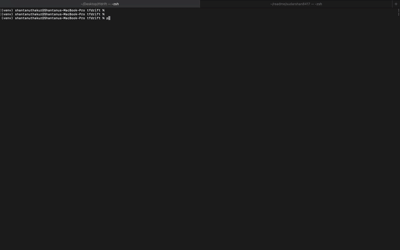

# tfdrift

**Continuous Terraform drift detection, reporting, and auto-remediation.**

[](https://pypi.org/project/tfdrift/)
[](LICENSE)
[](https://github.com/sudarshan8417/tfdrift/actions)



---

`tfdrift` is a Python CLI tool that monitors your Terraform-managed infrastructure for drift — changes made outside of Terraform workflows (console clicks, scripts, other tools). It scans your Terraform workspaces, detects discrepancies between state and reality, generates structured reports, and optionally auto-remediates or notifies your team.

**Why tfdrift?** The most popular open-source drift detection tool ([driftctl](https://github.com/snyk/driftctl)) has been in maintenance mode since mid-2023. Enterprise solutions like Terraform Enterprise cost $15K+/year. `tfdrift` fills the gap: a free, modern, actively maintained CLI that does one thing well.

## Features

- **Multi-workspace scanning** — Recursively discovers all Terraform workspaces in a directory tree
- **Structured drift reports** — JSON, Markdown, or human-readable table output
- **Severity classification** — Categorizes drift by risk level (critical/high/medium/low) based on resource type and attribute
- **Slack & webhook notifications** — Get alerted the moment drift is detected
- **Auto-remediation** — Optionally run `terraform apply` to fix drift (with safety guards)
- **CI/CD friendly** — Exit codes, JSON output, and GitHub Actions integration out of the box
- **Watch mode** — Continuously monitor for drift on a schedule
- **Ignore rules** — Filter out known/expected drift with `.tfdriftignore`

## Quick start

### Install

```bash
pip install tfdrift
```

### Scan for drift

```bash
# Scan current directory for all Terraform workspaces
tfdrift scan

# Scan a specific directory
tfdrift scan --path /path/to/terraform

# Output as JSON
tfdrift scan --format json

# Output as Markdown report
tfdrift scan --format markdown --output drift-report.md
```

### Watch mode (continuous monitoring)

```bash
# Check every 30 minutes, notify Slack on drift
tfdrift watch --interval 30m --slack-webhook https://hooks.slack.com/services/XXX
```

### Auto-remediate

```bash
# Auto-fix drift in dev (requires --confirm for safety)
tfdrift scan --auto-fix --confirm --env dev

# Dry run — show what would be fixed
tfdrift scan --auto-fix --dry-run
```

## Configuration

Create a `.tfdrift.yml` in your project root:

```yaml
# .tfdrift.yml
scan:
  paths:
    - ./infrastructure
    - ./modules
  exclude:
    - "**/test/**"
    - "**/.terraform/**"
  # Auto-detect .tfvars files in each workspace (default: true)
  auto_detect_var_files: true
  # Or specify explicit var files
  var_files:
    - envs/dev.tfvars
  # Or pass variables directly
  vars:
    environment: production
    region: us-east-1

severity:
  critical:
    - aws_security_group.*.ingress
    - aws_iam_policy.*.policy
    - aws_s3_bucket.*.acl
  high:
    - aws_instance.*.instance_type
    - aws_rds_instance.*.engine_version

notifications:
  slack:
    webhook_url: ${SLACK_WEBHOOK_URL}
    channel: "#infra-alerts"
    min_severity: high
  webhook:
    url: ${WEBHOOK_URL}
    method: POST

remediation:
  auto_fix: false
  allowed_environments:
    - dev
    - staging
  require_approval: true
  max_changes: 5  # safety limit

ignore:
  # Ignore expected drift
  - resource: aws_autoscaling_group.*
    attribute: desired_capacity
  - resource: aws_ecs_service.*
    attribute: desired_count
```

## Ignore rules

Create a `.tfdriftignore` file to skip known drift:

```
# Autoscaling changes are expected
aws_autoscaling_group.*.desired_capacity
aws_ecs_service.*.desired_count

# Tags managed by external system
*.tags.LastModified
*.tags.UpdatedBy
```

## CI/CD Integration

### GitHub Actions

```yaml
# .github/workflows/drift-check.yml
name: Terraform Drift Check
on:
  schedule:
    - cron: '0 */6 * * *'  # Every 6 hours
  workflow_dispatch:

jobs:
  drift-check:
    runs-on: ubuntu-latest
    steps:
      - uses: actions/checkout@v4
      - uses: hashicorp/setup-terraform@v3
      - uses: actions/setup-python@v5
        with:
          python-version: '3.11'
      - run: pip install tfdrift
      - run: tfdrift scan --format json --output drift-report.json
        env:
          AWS_ACCESS_KEY_ID: ${{ secrets.AWS_ACCESS_KEY_ID }}
          AWS_SECRET_ACCESS_KEY: ${{ secrets.AWS_SECRET_ACCESS_KEY }}
      - uses: actions/upload-artifact@v4
        if: failure()
        with:
          name: drift-report
          path: drift-report.json
```

### GitLab CI

```yaml
drift-check:
  image: python:3.11
  before_script:
    - pip install tfdrift
    - apt-get update && apt-get install -y terraform
  script:
    - tfdrift scan --format json --output drift-report.json
  rules:
    - if: $CI_PIPELINE_SOURCE == "schedule"
  artifacts:
    paths:
      - drift-report.json
    when: on_failure
```

## Exit codes

| Code | Meaning |
|------|---------|
| 0 | No drift detected |
| 1 | Drift detected |
| 2 | Error during scan |
| 3 | Drift detected and auto-remediated |

## Architecture

```
tfdrift/
├── commands/        # CLI command handlers (scan, watch, init)
├── detectors/       # Drift detection engine (terraform plan parser)
├── reporters/       # Output formatters (JSON, Markdown, table, Slack)
├── remediators/     # Auto-fix logic with safety guards
├── config.py        # Configuration loader (.tfdrift.yml)
├── models.py        # Data models (DriftResult, Resource, etc.)
├── severity.py      # Severity classification engine
└── cli.py           # CLI entry point (Click)
```

## Comparison with alternatives

| Feature | tfdrift | driftctl (archived) | terraform plan | Terraform Enterprise |
|---------|---------|-------------------|----------------|---------------------|
| Active maintenance | ✅ | ❌ (since 2023) | ✅ | ✅ |
| Multi-workspace scan | ✅ | ❌ | ❌ | ✅ |
| Severity classification | ✅ | ❌ | ❌ | ❌ |
| Auto-remediation | ✅ | ❌ | ❌ | ✅ |
| Slack/webhook alerts | ✅ | ✅ | ❌ | ✅ |
| Watch mode | ✅ | ❌ | ❌ | ✅ |
| Ignore rules | ✅ | ✅ | ❌ | ❌ |
| Cost | Free | Free | Free | $15K+/yr |
| Language | Python | Go | Go (HCL) | Proprietary |

## Contributing

Contributions are welcome! Please see [CONTRIBUTING.md](CONTRIBUTING.md) for guidelines.

```bash
# Development setup
git clone https://github.com/sudarshan8417/tfdrift.git
cd tfdrift
python -m venv venv
source venv/bin/activate
pip install -e ".[dev]"
pytest
```

## License

Apache License 2.0 — see [LICENSE](LICENSE) for details.

## Acknowledgments

Inspired by [driftctl](https://github.com/snyk/driftctl) and the Terraform community's need for maintained, open-source drift detection tooling.
